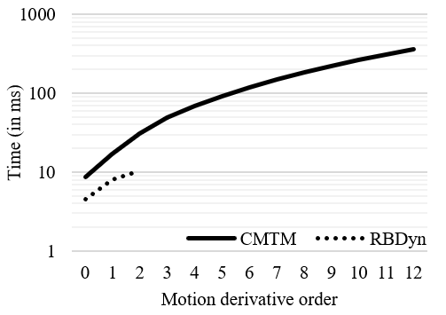
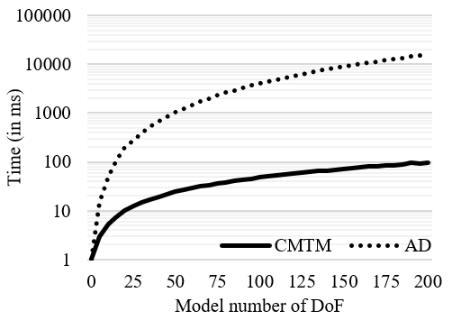

# CDM

The comprehensive Dynamics motion (CDM) is a library built on top of COMA library to run algorithms along N-CMTM tool.

## Table of contents
 1. [Installation](#Installation)
 2. [Results](#Results)
 3. [Reference](#Reference)

## Installation

The V1 is still in WIP.
The V0 is an executable used for RSS2021 that has working algorithms, tests and benchmarks.

### Dependencies

To compile you need the following tools:

 * [Git]()
 * [CMake]() >= 3.8.2
 * [doxygen]()
 * [g++]() >= 8.3 (for C++17 support)
 * [Eigen](http://eigen.tuxfamily.org/index.php?title=Main_Page) >= 3.2
 * [coma](https://github.com/vsamy/coma)
 * [RBDyn](https://github.com/jrl-umi3218/RBDyn)

For v0:

 * [CppAD](https://github.com/coin-or/CppAD)
 * [benchmark](https://github.com/google/benchmark)

### Building

```sh
git clone --recursive https://github.com/vsamy/coma
cd cdm
mkdir build
cd build
cmake [options] ..
make -j8 install
```

### Building V0

```sh
git clone --recursive https://github.com/vsamy/coma
cd cdm
mkdir build
cd build
cmake -DBUILD_V0=ON ..
make -j8
```

## Results

Some comparison results

### V0

Here are some benchmarks made with google benchmarks and a i7-7700HQ@2.80GHz.

The next graph is the FK computation time of 100-DoF model (CDM vs RBDyn) depending on the order of the N-CMTM. CDM is 2 to 5 times slower.



The next graph is the computation time of the FK (CDM VS AD) depending on the number of DoF of the system. At 200-DoF, CDM is more than 100 times faster. In this case, with use AD to compute the second-order derivative of the acceleration (snap).



Here are comparison of CDM with different methods for different orders.

order | RBDyn | dv_p(t) | ddv_p(t) | AD
------|-------|---------|----------|---
velocity | 5.18703e-16 | / | / | 2.28878e-16
accel... | 1.75542e-15 | 1.08502e-7 | / | 88578e-16
jerk | / | 2.83273e-7 | 15.6074 | 1.50195e-15
snap | / | 5.10762e-7 | 54.8067 | 2.27058e-15
crackle | / | 8.10141e-7 | 150.261 | / 

Next table is a comparison between CDM and different methods for the ID

order | RBDyn | dv_p(t)
------|-------|--------
0 (momentum) | 5.62864e-16 | /
0 (torque) | 4.33414e-15 | /
1 | / | 1.04706e-6
2 | / | 1.2258e-6
3 | / | 2.0509e-6

Finally, the next table represents the max error of Jacobian (*1e-16) computation where `A` stands fot eh `aleph` (the comprehensive motion) and `J`, `K`, `N`, `B`, `Q` and `R` are respectively the link Jacobian, the link momentum Jacobian, the link force Jacobian, the joint momentum Jacobian, the joint force Jacobian and the joint torque Jacobian.

order | JA | KA | NA | BA | QA/RA
------|----|----|----|----|------
1 | 1.49629 | 1.49629 | 1.49629 | 23.5579 | 23.5579
2 | 15.6296 | 22.2720 | 20.1281 | 143.064 | 99.2641
3 | 87.0878 | 87.6064 | 76.7999 | 148.885 | 120.504
4 | 193.816 | 209.061 | 163.068 | 842.994 | 944.174
5 | 766.013 | 547.351 | 887.600 | 2277.34 | 3241.04

## Reference

Related paper is freely accessible [here](https://roboticsconference.org/program/papers/032/)